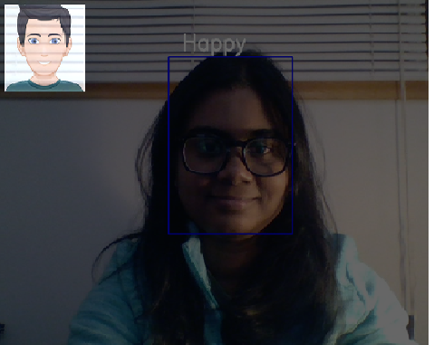

# MachineLearningProject

In this project, we have developed an application that will capture a human expression via the camera and transform it to a corresponding cartoon avatar of that particular person. Emojis or avatars plays  an integral role in indicating non verbal cues. These cues are used in widespread in the areas of online chatting, brand endorsement and for several other commercial purposes. In this project, at first the live video feeds of the face will be captured to analyse the emotion.Then we will develop a CNN architecture and the model will be trained on the dataset for Human Emotion Recognition.This model will classify the facial expressions based on the images of the dataset and then these emotions will be mapped to the corresponding avatar.

## Work Flow:

The work flow has been depictedin the following diagram.

## Libraries used:
1) Keras
2)Open CV
3)numpy
4)Pandas
Programming Language: Python
IDE: JupyterNotebook

## DataSet:

The dataset used in this project is the facial expression recognition dataset.It consists of 48x48 pixel grayscale face images which are centered occupying equal amount of spaces.There are 6 facial emotions that are depicted in the dataset. The dataset is the ‘Facial Expression Recognition Dataset’ from Kaggle.

## Result:

Here the result shows that a happy expression captured by the application is being reflected by the emoji.

